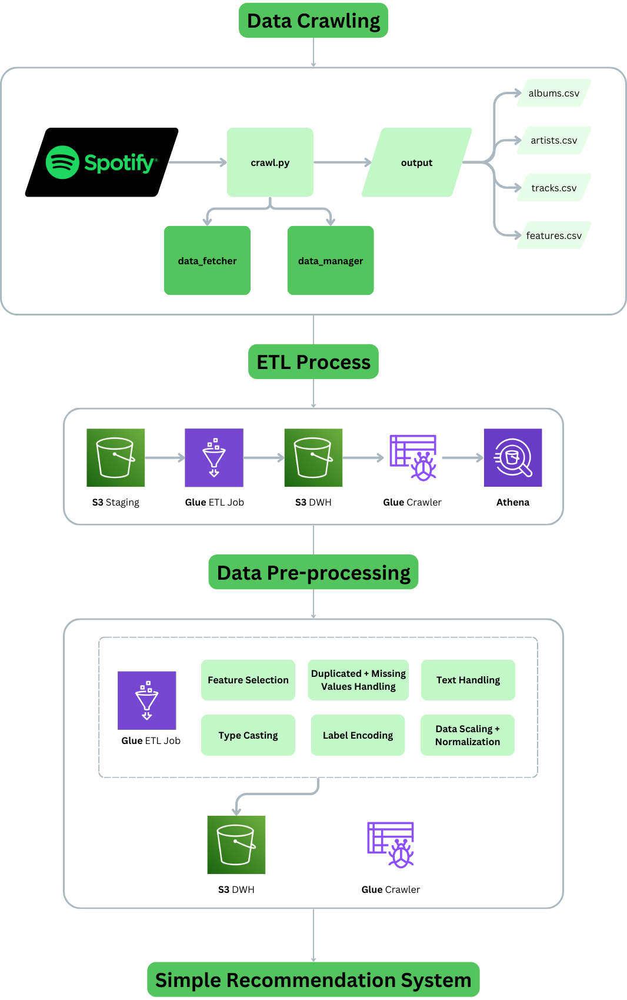

# Spotify Data Crawling: Exploring My Favorite Artists
Welcome to my Spotify Project repository! 🎵

As a dedicated music enthusiast and daily Spotify user, I embarked on this project to dive deep into the discographies of my favorite artists. This repository showcases my work with the Spotify API to fetch, analyze and my other further exploration on this dataset.

## Overview

This project outlines the architecture and steps for developing a simple music recommendation system using Spotify's music data. The system consists of several components: data crawling, an ETL process, data pre-processing, and a recommendation algorithm.


### Project Components

1. **Data Crawling**: This phase involves fetching music data from Spotify using a script (`crawl.py`) and storing the results in CSV files (`albums.csv`, `artists.csv`, `tracks.csv`, `features.csv`).

2. **ETL Process**: Extract, Transform, and Load (ETL) processes are employed to stage the crawled data in S3, process it using AWS Glue ETL jobs, and store it in a Data Warehouse (S3 DWH). The processed data is then crawled using AWS Glue Crawler to be available for querying using Athena.

3. **Data Pre-processing**: The pre-processing stage includes several key steps such as feature selection, handling duplicates and missing values, text handling, type casting, label encoding, and data scaling and normalization. This stage ensures that the data is clean and properly formatted for the recommendation system.

4. **Simple Recommendation System**: A KMeans clustering algorithm is used to cluster the processed music data, and a recommendation algorithm is developed to suggest songs based on user input.

## Getting Started

### Prerequisites

- Python 3.x
- AWS Glue, S3, Athena
- Spotipy library for interacting with Spotify API
- Other required Python libraries: `pandas`, `numpy`, `sklearn`, `yellowbrick`, `plotly`, `dotenv`, `scipy`

### Data Crawling

Use the `crawl.py` script to fetch data from Spotify. Ensure you have the appropriate Spotify API credentials and the necessary Python libraries installed. The fetched data will be stored in multiple CSV files.

### ETL Process

1. **Staging**: Upload the crawled data to an S3 bucket.
2. **Transformation**: Create a Glue ETL job to process the data and store it in the S3 Data Warehouse (S3 DWH).
3. **Loading**: Use Glue Crawler to make the processed data available in Athena for querying.

### Data Pre-processing

Pre-process the data using the steps outlined in the ETL process. The following transformations are applied:

- **Feature Selection**: Choose relevant features for the recommendation model.
- **Handling Missing and Duplicate Values**: Remove or impute missing data and eliminate duplicate entries.
- **Text Handling**: Preprocess text data where necessary.
- **Type Casting**: Ensure all data types are correctly formatted.
- **Label Encoding**: Convert categorical variables into numerical format.
- **Data Scaling and Normalization**: Normalize and scale features to ensure all variables are on a similar scale.

### Recommendation System

The recommendation system is built using the following steps:

1. **Data Preparation**: Import the `processed` dataset derived from previous processes on AWS and prepare it for clustering.
2. **Label Encoding and Scaling**: Apply label encoding to categorical data and MinMaxScaler for feature scaling.
3. **Clustering**: Use the KMeans algorithm to cluster the data. The KElbowVisualizer helps determine the optimal number of clusters.
4. **Visualization**: Visualize the clustered data using PCA (Principal Component Analysis) and Plotly.
5. **Song Recommendation**: Implement functions to recommend songs based on user input using Spotify's data and the clustered model.

### Code

The provided code includes all necessary steps to create and test the recommendation system. Ensure that all dependencies are installed and environment variables are set up correctly to interact with the Spotify API.

## Usage

To run the recommendation system:

1. Set up your environment and install the necessary Python libraries.
2. Run the data crawling script to fetch data from Spotify.
3. Execute the ETL process to clean and transform the data.
4. Use the provided Python code to perform clustering and generate recommendations.
5. Input song names and artists to receive personalized music recommendations.

### Example Usage

```python
# Asking for recommendations based on BTS's Magic Shop song
pd.DataFrame(recommend_songs([{'track_name': 'Magic Shop', 'artists': 'BTS'}],  df_scaled))
```
## Conclusion
This project demonstrates a simple yet effective approach to building a music recommendation system using Spotify's data, AWS services, and machine learning techniques. The flowchart and steps outlined provide a clear roadmap for implementing a robust and scalable recommendation system.